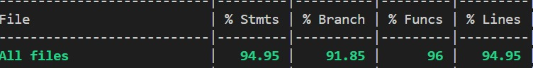

# RETROSPECTIVE Sprint 2 (Team 13)

The retrospective should include _at least_ the following
sections:

- [process measures](#process-measures)
- [quality measures](#quality-measures)
- [general assessment](#assessment)

## PROCESS MEASURES

### Macro statistics

- Number of stories committed vs. done
  - Committed: 4+4 (The first 4 stories from the previous sprint required updates as requested by the stakeholders)
  - Done: 8
- Total points committed vs. done
  - Committed: 18 (9 points for previous sprint stories)
  - Done: 18
- Nr of hours planned vs. spent (as a team)
  - Planned: 95h 40m
  - Done: 97h 05m

**Remember** a story is done ONLY if it fits the Definition of Done:

- Unit Tests passing
- Code review completed
- Code present on VCS
- End-to-End tests performed

> Please refine your DoD if required (you cannot remove items!)

### Detailed statistics

| Story | # Tasks | Points | Hours est. | Hours actual |
|--------|---------|--------|------------|--------------|
| _#0_ | 30 |  | 49h 45m | 50h 05m |
| _KX1_ | 7 | 2 | 4h | 4h  |
| _KX2_ | 13 | 3 | 6h 50m | 6h 45m |
| _KX3_ | 3 | 1 | 0h 45m | 0h 55m |
| _KX4_ | 4 | 3 | 4h | 4h 50m |
| _KX5_ | 13 | 3 | 9h 45m | 9h 40m |
| _KX6_ | 2 | 1 | 2h | 2h |
| _KX7_ | 11 | 2 | 7h 45m | 8h 10m  |
| _KX8_ | 17 | 3 | 10h 50m| 10h 40m |

> story `#0` is for technical tasks, leave out story points (not applicable in this case)

- Hours per task average, standard deviation (estimate and actual)
  - Estimated: 0h 57m
  - Actual: 0h 58m
- Total estimation error ratio: sum of total hours spent / sum of total hours effort - 1
  $$\frac{\sum_i spent_{task_i}}{\sum_i estimation_{task_i}} - 1$$

  - (94h 35m)/(94h 20m) -1 = 0.0148
- Absolute relative task estimation error: sum( abs( spent-task-i / estimation-task-i - 1))/n
  
  $$\frac{1}{n}\sum_i^n \left| \frac{spent_{task_i}}{estimation_task_i}-1 \right| $$
   - 0.08302

## QUALITY MEASURES

- Unit Testing:
  - Total hours estimated: 14h 50m
  - Total hours spent: 13h 35m
  - Nr of automated unit test cases: 155
  - Coverage (if available): 
- E2E testing:
  - Total hours estimated: 6h
  - Total hours spent: 6h
- Code review
  - Total hours estimated: 1h 45m
  - Total hours spent: 1h 45m

## ASSESSMENT

- What caused your errors in estimation (if any)?
  - Tasks that required the use of a new technology took slightly longer than estimated. Other than that, the overall estimations were pretty balanced and appropriately assigned.

- What lessons did you learn (both positive and negative) in this sprint?
  - 

- Which improvement goals set in the previous retrospective were you able to achieve?
  - We were able to achieve both goals set out in the previous retrospective
    1. More strict internal deadlines for delivering of APIs etc. to further improve coherency in workflow
    2. One-to-one meetings between backend and frontend developers to understand formats and details of APIs and code

- Improvement goals for the next sprint and how to achieve them (technical tasks, team coordination, etc.)
  - We aim to improve the quality of our code through more code reviews and code cleanup 
  - More manual testing should be done earlier in the sprint to avoid last minute changes and provide ample time for improvement of components 

  > Propose one or two

- One thing you are proud of as a Team!!
  - All of us now understand the workflow
