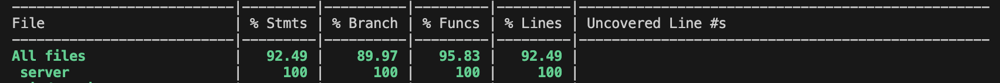

TEMPLATE FOR RETROSPECTIVE (Team 13)
=====================================

The retrospective should include _at least_ the following
sections:

- [process measures](#process-measures)
- [quality measures](#quality-measures)
- [general assessment](#assessment)

## PROCESS MEASURES 

### Macro statistics

- Number of stories committed vs done
  - Stories Committed: 6+5 (6 new stories. 5 stories from previous sprints that required updates as per stakeholder requests)
  - Stories Done: 11
  - Total Stories Completed of Project: 14 (Up till KX11)
- Total points committed vs done 
  - Committed: 24 (12 points of previous sprint stories)
  - Done: 24
- Nr of hours planned vs spent (as a team)
  - Planned: 96h 30m
  - Spent: 97h 55m

**Remember**  a story is done ONLY if it fits the Definition of Done:
 
- Unit Tests passing
- Code review completed
- Code present on VCS
- End-to-End tests performed

> Please refine your DoD 

### Detailed statistics

| Story  | # Tasks | Points | Hours est. | Hours actual |
|--------|---------|--------|------------|--------------|
| _#0_   |    21     |    -   |    46h 20m  |    46h 35m         |
| _KX1_  |   5      |    2    |    5h 30m    |   6h 15m     |
| _KX2_  |   4      |     3   |   4h  00m       |   3h 50m       |
| _KX4_  |     3    |   3     |  2h 15m     |   4h 15m         |
| _KX5_   |   1      |  3      |  0h 30m         |  0h 30m      |
| _KX6_   |   3      |  1      | 3h 30m       |   3h 30m         |
| _KX9_   |    8     |   3     |    9h 00m    |     8h 00m    |
| _KX10_  |   16      |   3     |   15h 5m     |   15h 15m   |
| _KX11_  |    1     |   1     |     1h 00m       |    0h 50m   |
| _KX14_  |   4      |   1     |    1h 50m   |      1h 40m    |
| _KX19_  |     6    |   3     |     6h 00m    |      6h 20m     |
| _KX20_  |    2     |   1     |    2h 30m        |   1h 55m |
   

> place technical tasks corresponding to story `#0` and leave out story points (not applicable in this case)

- Hours per task (average, standard deviation)
  - Estimated: 1h 17m
  - Spent: 1h 19m
- Total task estimation error ratio: sum of total hours estimation / sum of total hours spent -1
  - ((96h 30m) / (97h 55m)) -1
  - -0.014

  
## QUALITY MEASURES 

- Unit Testing:
  - Total hours estimated: 5h 15m
  - Total hours spent: 5h 15m
  - Nr of automated unit test cases: 110 
  - Coverage (if available):  
- E2E testing:
  - Total hours estimated: 7h 40m
  - Total hours spent: 7h 50m
- Code review 
  - Total hours estimated: 1h
  - Total hours spent: 1h
- Technical Debt management:
  - Strategy adopted: 
    - We aimed to fix all issues that were giving a C rating in SonarQube.
    - We added more tasks for code review and code cleanup and allocated individual tasks for technical debt management in the sprint.
    - When talking with the professor during the previous retrospective, we decided to stop with frontend unit testing that we have done till the end of sprint 2 with React testing library. Testing single components that implement complex functionalities through other libraries becomes basically a mock of the entire page, which means that you are not testing the component anymore. Even if this strategy reduces the time spent with testing and probably increases the TD debt, we thought it was reasonable not to spend a lot of time testing a mock that does not really reflect the component.
    - [Technical Debt Strategy](../TD_strategy.md)
  - Total hours estimated estimated at sprint planning: 6h
  - Total hours spent: 6h 55m
  

## ASSESSMENT

- What caused your errors in estimation (if any)?
  - Overall the estimations were balanced especially for the new stories. However, we noticed that we had underestimated the effort required for certain stories that were to be changed upon the request of the stakeholders.

- What lessons did you learn (both positive and negative) in this sprint?
  - We learnt that technical debt management should be done at the start to understand what practices to avoid during code development. 

- Which improvement goals set in the previous retrospective were you able to achieve?   
  - ⁠We were able to achieve both goals set out in the previous retrospective
    1. The quality of the code has been improved, especially in the client side, by dividing the components in more modules and thus creating a better code structure.
    2. Every component of the team has tested extensively both old and new features of the application.

  
- Which ones you were not able to achieve? Why?
  - We were able to achieve both the goals set out. 

- Improvement goals for the next sprint and how to achieve them (technical tasks, team coordination, etc.)
  - We want to refine details of the application to make it more functional and aesthetically pleasing.

- One thing you are proud of as a Team!!
  - We were able to deliver all the committed stories and have been able to deliver a well-functioning product so far.
  - 