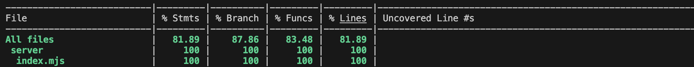

# TEMPLATE FOR RETROSPECTIVE (Team 13)

The retrospective should include _at least_ the following
sections:

- [process measures](#process-measures)
- [quality measures](#quality-measures)
- [general assessment](#assessment)

## PROCESS MEASURES

### Macro statistics

- Number of stories committed vs done
  - Committed: 5+6 (5 new stories, 6 stories from previous sprints that required updates as per stakeholder requests)
  - Done: 11
- Total points committed vs done
  - Committed: 27 (13 points of previous sprint stories)
  - Done: 27
- Nr of hours planned vs spent (as a team)
  - Planned: 96h 15m
  - Spent: 96h 35m

**Remember** a story is done ONLY if it fits the Definition of Done:

- Unit Tests passing
- Code review completed
- Code present on VCS
- End-to-End tests performed

> Please refine your DoD

### Detailed statistics

| Story   | # Tasks | Points | Hours est. | Hours actual |
| ------- | ------- | ------ | ---------- | ------------ |
| _#0_    | 29      | -      | 50h 55m    | 51h 10m      |
| _#KX1_  | 9       | 2      | 5h 20m     | 5h 40m       |
| _#KX6_  | 4       | 1      | 6h 30m     | 6h 30m       |
| _#KX9_  | 1       | 3      | 0h 45m     | 1h 00m       |
| _#KX19_ | 6       | 3      | 4h 45m     | 4h 15m       |
| _#KX10_ | 8       | 3      | 8h 00m     | 8h 05m       |
| _#KX11_ | 1       | 1      | 0h 30m     | 0h 30m       |
| _#KX17_ | 7       | 3      | 4h 25m     | 4h 20m       |
| _#KX12_ | 5       | 5      | 4h 00m     | 4h 00m       |
| _#KX13_ | 6       | 2      | 4h 30m     | 4h 30m       |
| _#KX15_ | 5       | 2      | 4h 00m     | 3h 45m       |
| _#KX16_ | 4       | 2      | 2h 05m     | 2h 00m       |

> place technical tasks corresponding to story `#0` and leave out story points (not applicable in this case)

- Hours per task average, standard deviation (estimate and actual)

|            | Mean  | StDev |
| ---------- | ----- | ----- |
| Estimation | 71.1m | 76.7m |
| Actual     | 67.4m | 76.7m |

- Total estimation error ratio: sum of total hours spent / sum of total hours effort - 1

  $$\frac{\sum_i spent_{task_i}}{\sum_i estimation_{task_i}} - 1 = 0.0035$$

- Absolute relative task estimation error: sum( abs( spent-task-i / estimation-task-i - 1))/n

  $$\frac{1}{n}\sum_i^n \left| \frac{spent_{task_i}}{estimation_task_i}-1 \right|  = 0.062$$

## QUALITY MEASURES

- Unit Testing:
  - Total hours estimated: 3h 30m
  - Total hours spent: 3h 30m
  - Nr of automated unit test cases: 82
  - Coverage: 
- E2E testing:
  - Total hours estimated: 5h
  - Total hours spent: 5h
  - Nr of test cases: 108 (96 manual tests + 12 Cypress tests)
- Code review
  - Total hours estimated: 2h 30m
  - Total hours spent: 2h 30m
- Technical Debt management:
  - Strategy adopted:
    - We aimed to fix all issues that were giving a C rating in SonarQube.
    - We added more tasks for code review and code cleanup and allocated individual tasks for technical debt management in the sprint.
    - [Technical Debt Strategy](../TD_strategy.md)
  - Total hours estimated estimated: 4h
  - Total hours spent: 4h

## ASSESSMENT

- What caused your errors in estimation (if any)?
  - In this sprint the estimation time was similar to spent time because through the various sprint our capacity to estimate got better and since we focused a lot of effort on the frontend, so although some tasks were overestimated the total time spent is similar because the time overestimated can be used for the design process.
- What lessons did you learn (both positive and negative) in this sprint?
  - This sprint made us learn that, when dealing with large projects, facing the design with a clear idea of dependencies is crucial for the estimation and the subdivision into tasks. In particular, every small change causes a lot of side effects in other parts of the code. We experienced it with unit tests in the backend and thus we had to accept a lower coverage with respect to the one we were able to mantain in the first three sprints (even if we never added it to the definition of done as a requisite). However, when the project is larger and has a structure, it is more pleasant to work on it and, if the structure is well defined, the time is completely used to include new functionalities.
- Which improvement goals set in the previous retrospective were you able to achieve?
  - We had aimed to refine the details of our application to improve functionality and make it more aesthetically pleasing. We were able to achieve this goal!
- Which ones you were not able to achieve? Why?

  - We were able to achieve the goals set out

- Improvement goals for the next sprint and how to achieve them (technical tasks, team coordination, etc.)

> Propose one or two

- One thing you are proud of as a Team!!
  - This has been the biggest project that most of us have ever faced, so, the first thing we are proud of is the result. Moreover, in many occasions we had to face the development of technologies we were not confident with and we have always been able to succeed in the implementation, which is something we are really proud of because it means we have learnt how to face unknown problems in our university career so far.
